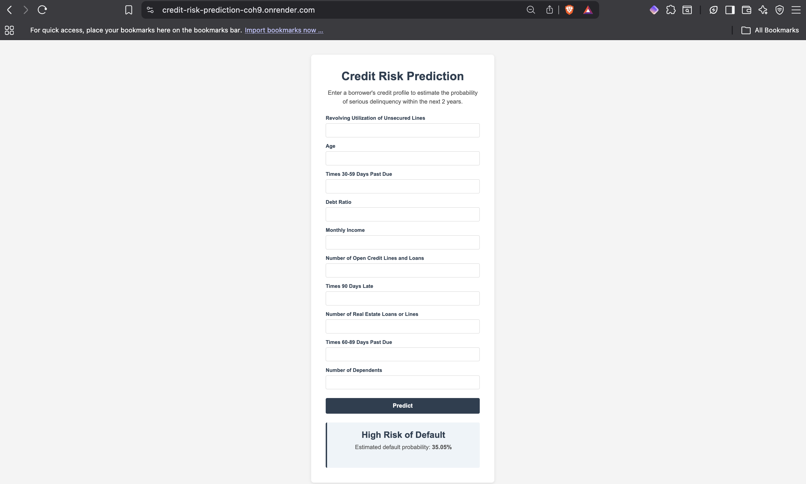

# Credit Risk Prediction

A machine learning pipeline and Flask web app that predicts the probability
of serious loan delinquency within 2 years, based on the
[Give Me Some Credit](https://www.kaggle.com/c/GiveMeSomeCredit) dataset.

## 🚀 Live Demo

🔗 https://credit-risk-prediction-coh9.onrender.com

## 📸 Application Screenshot
<p align="center">
  
</p>

## Overview

This project trains a classification model to flag borrowers at risk of
serious default (`SeriousDlqin2yrs`), using features like credit
utilization, age, debt ratio, income, and delinquency history. Because
defaults are rare (~6.7% of borrowers), the pipeline handles class
imbalance explicitly and optimizes for ROC-AUC rather than raw accuracy.

**Best model:** XGBoost Classifier (balanced)
**ROC-AUC:** 0.853
**Recall on defaulters:** 72.6%

## Project Structure

```
CreditRiskPrediction/
├── application.py                 # Flask app entry point
├── artifact/                      # Generated: data splits, preprocessor, model
├── notebook/
│   └── data/cs-training.csv       # Raw dataset
├── src/
│   ├── components/
│   │   ├── data_ingestion.py      # Load, clean, split data
│   │   ├── data_transformation.py # Impute + scale features
│   │   └── model_trainer.py       # Tune, train, evaluate, save best model
│   ├── pipeline/
│   │   └── predict_pipeline.py    # Load model + predict on new input
│   ├── exception.py                # Custom exception handling
│   ├── logger.py                   # Logging setup
│   └── utils.py                    # save_object, load_object, evaluate_models
├── templates/
│   └── index.html                  # Form + results page
├── static/
│   └── style.css
├── requirements.txt
└── setup.py
```

## Setup

```bash
python3 -m venv venv
source venv/bin/activate
pip install -r requirements.txt
```

## Running the Training Pipeline

Trains the model from scratch and saves artifacts to `artifact/`:

```bash
python -m src.components.data_ingestion
```

This runs, in order:
1. **Data ingestion** — reads `cs-training.csv`, drops invalid rows
   (`age == 0`, placeholder values `96`/`98` in delinquency columns),
   performs a stratified train/test split.
2. **Data transformation** — imputes missing values (median) and scales
   numerical features, saves `preprocessor.pkl`.
3. **Model training** — tunes Random Forest and XGBoost via
   `RandomizedSearchCV`, handles class imbalance
   (`class_weight='balanced'`, `scale_pos_weight`), selects the best
   model by test ROC-AUC, saves `model.pkl`.

## Running the Web App

```bash
python application.py
```

Then open `http://127.0.0.1:5000` in your browser. Fill in the borrower's
credit profile and submit to get a risk classification and default
probability.

**Note:** `debug=True` is fine for local development but must be set to
`debug=False` in `application.py` before deploying (e.g., to AWS Elastic
Beanstalk), since debug mode exposes an interactive code execution
console on unhandled errors.

## Model Details

| Metric | Value |
|---|---|
| Model | XGBoost (balanced) |
| ROC-AUC | 0.853 |
| Accuracy | 0.814 |
| Precision | 0.222 |
| Recall | 0.726 |
| F1 | 0.339 |

Accuracy is intentionally lower than a naive baseline (~94%, achieved by
predicting "no default" for everyone) because the model is tuned to
actually catch defaulters rather than optimize for the majority class.
Precision/recall can be adjusted via the classification threshold in
`predict_pipeline.py` depending on how conservative the use case
requires (default: `0.3`).

## Tech Stack

- Python, scikit-learn, XGBoost
- Flask (web app)
- Pandas / NumPy
- dill (model serialization)

